<p align="center">
  
</p>

<p align="center">
  <strong>A digital twin of AWS. Free forever. Runs anywhere.</strong><br>
  MIT licensed · No registration · No telemetry · Drop-in replacement for LocalStack
</p>

<p align="center">
  <a href="#quick-start">Quick Start</a> ·
  <a href="#accounts--regions">Accounts & Regions</a> ·
  <a href="#for-ai-agents">For AI Agents</a> ·
  <a href="#supported-services">147 Services</a> ·
  <a href="#why-robotocore">Why robotocore</a> ·
  <a href="#architecture">Architecture</a> ·
  <a href="AGENTS.md">AGENTS.md</a>
</p>

---

## What is robotocore?

robotocore (named for [botocore](https://github.com/boto/botocore)) is a **digital twin of AWS** — a faithful local replica that responds to real AWS API calls. Point any AWS SDK, CLI, or AI agent at `http://localhost:4566` and it behaves like AWS.

- **147 AWS services** — S3, Lambda, DynamoDB, SQS, SNS, IAM, CloudFormation, and more
- **Behavioral fidelity** — Lambda actually executes, SQS has real visibility timeouts, SigV4 auth works
- **Multi-account** — unlimited isolated AWS accounts, all in one container
- **Single container** — one `docker run` command, no config, no cloud
- **MIT licensed** — free forever, no paid tiers, no registration, no telemetry

Built by [Jack Danger](https://github.com/jackdanger), a maintainer of [Moto](https://github.com/getmoto/moto), on top of Moto's ~195 service implementations.

---

## Quick Start

```bash
# Docker Hub
docker run -d -p 4566:4566 jackdanger/robotocore:latest

# GitHub Container Registry (alternative)
docker run -d -p 4566:4566 ghcr.io/jackdanger/robotocore:latest
```

Verify it's running:

```bash
curl -s http://localhost:4566/_localstack/health | python3 -m json.tool
```

### Python (boto3)

```python
import boto3

# Point any boto3 client at localhost:4566
# Any non-empty string works for credentials — the 12-digit access key IS your account ID
s3 = boto3.client(
    "s3",
    endpoint_url="http://localhost:4566",
    aws_access_key_id="123456789012",
    aws_secret_access_key="test",
    region_name="us-east-1",
)
s3.create_bucket(Bucket="my-bucket")
s3.put_object(Bucket="my-bucket", Key="hello.txt", Body=b"Hello, world!")
print(s3.get_object(Bucket="my-bucket", Key="hello.txt")["Body"].read())
# b"Hello, world!"
```

### AWS CLI

```bash
export AWS_ENDPOINT_URL=http://localhost:4566
export AWS_ACCESS_KEY_ID=123456789012
export AWS_SECRET_ACCESS_KEY=test
export AWS_DEFAULT_REGION=us-east-1

aws s3 mb s3://my-bucket
aws sqs create-queue --queue-name my-queue
aws lambda list-functions
aws dynamodb list-tables
```

### docker-compose

```yaml
services:
  aws:
    image: jackdanger/robotocore:latest
    ports:
      - "4566:4566"

  app:
    build: .
    environment:
      - AWS_ENDPOINT_URL=http://aws:4566
      - AWS_ACCESS_KEY_ID=123456789012
      - AWS_SECRET_ACCESS_KEY=test
      - AWS_DEFAULT_REGION=us-east-1
```

### GitHub Actions

```yaml
jobs:
  test:
    runs-on: ubuntu-latest
    services:
      robotocore:
        image: jackdanger/robotocore:latest
        ports:
          - 4566:4566
        options: >-
          --health-cmd "curl -f http://localhost:4566/_localstack/health"
          --health-interval 5s
          --health-retries 10
    steps:
      - uses: actions/checkout@v4
      - run: pytest tests/
        env:
          AWS_ENDPOINT_URL: http://localhost:4566
          AWS_ACCESS_KEY_ID: "123456789012"
          AWS_SECRET_ACCESS_KEY: test
          AWS_DEFAULT_REGION: us-east-1
```

---

## Accounts & Regions

robotocore supports **multiple AWS accounts** and **all regions** simultaneously, with complete state isolation between them.

### How account IDs work

The 12-digit number you use as `aws_access_key_id` is your account ID. That's it — no setup required.

```python
import boto3

def client(service, account_id, region="us-east-1"):
    return boto3.client(
        service,
        endpoint_url="http://localhost:4566",
        aws_access_key_id=account_id,
        aws_secret_access_key="test",
        region_name=region,
    )

# Two completely isolated AWS accounts
prod  = client("s3", "111111111111")
dev   = client("s3", "222222222222")

prod.create_bucket(Bucket="assets")   # exists only in account 111111111111
dev.create_bucket(Bucket="assets")    # separate bucket in account 222222222222

# Resources in one account are invisible to the other
print(prod.list_buckets()["Buckets"])  # [{"Name": "assets", ...}]
print(dev.list_buckets()["Buckets"])   # [{"Name": "assets", ...}]  — separate state
```

### Multi-region

Resources are also isolated by region. Use any valid AWS region name:

```python
us = client("dynamodb", "123456789012", region="us-east-1")
eu = client("dynamodb", "123456789012", region="eu-west-1")

us.create_table(TableName="orders", ...)  # exists only in us-east-1
# eu.list_tables() → []  — completely separate
```

### Cross-account access with STS

Use STS `AssumeRole` to simulate cross-account IAM role patterns:

```python
sts = client("sts", "111111111111")
assumed = sts.assume_role(
    RoleArn="arn:aws:iam::222222222222:role/CrossAccountRole",
    RoleSessionName="session",
)
creds = assumed["Credentials"]

# Now operate as account 222222222222
cross = boto3.client(
    "s3",
    endpoint_url="http://localhost:4566",
    aws_access_key_id=creds["AccessKeyId"],
    aws_secret_access_key=creds["SecretAccessKey"],
    aws_session_token=creds["SessionToken"],
)
```

### Default account

If you omit credentials or use a non-numeric access key (e.g. `"test"`), robotocore uses the default account ID: **`123456789012`** — the same default as Moto, which avoids cross-tool conflicts.

---

## Accounts & Regions

robotocore supports **multiple AWS accounts** and **all regions** simultaneously, with complete state isolation between them.

### How account IDs work

The 12-digit number you use as `aws_access_key_id` is your account ID. That's it — no setup required.

```python
import boto3

def client(service, account_id, region="us-east-1"):
    return boto3.client(
        service,
        endpoint_url="http://localhost:4566",
        aws_access_key_id=account_id,
        aws_secret_access_key="test",
        region_name=region,
    )

# Two completely isolated AWS accounts
prod  = client("s3", "111111111111")
dev   = client("s3", "222222222222")

prod.create_bucket(Bucket="assets")   # exists only in account 111111111111
dev.create_bucket(Bucket="assets")    # separate bucket in account 222222222222

# Resources in one account are invisible to the other
print(prod.list_buckets()["Buckets"])  # [{"Name": "assets", ...}]
print(dev.list_buckets()["Buckets"])   # [{"Name": "assets", ...}]  — separate state
```

### Multi-region

Resources are also isolated by region. Use any valid AWS region name:

```python
us = client("dynamodb", "123456789012", region="us-east-1")
eu = client("dynamodb", "123456789012", region="eu-west-1")

us.create_table(TableName="orders", ...)  # exists only in us-east-1
# eu.list_tables() → []  — completely separate
```

### Cross-account access with STS

Use STS `AssumeRole` to simulate cross-account IAM role patterns:

```python
sts = client("sts", "111111111111")
assumed = sts.assume_role(
    RoleArn="arn:aws:iam::222222222222:role/CrossAccountRole",
    RoleSessionName="session",
)
creds = assumed["Credentials"]

# Now operate as account 222222222222
cross = boto3.client(
    "s3",
    endpoint_url="http://localhost:4566",
    aws_access_key_id=creds["AccessKeyId"],
    aws_secret_access_key=creds["SecretAccessKey"],
    aws_session_token=creds["SessionToken"],
)
```

### Default account

If you omit credentials or use a non-numeric access key (e.g. `"test"`), robotocore uses the default account ID: **`123456789012`** — the same default as Moto, which avoids cross-tool conflicts.

---

## For AI Agents

> **If you are an AI agent**, read [AGENTS.md](AGENTS.md) — it's a standalone reference with everything you need: Docker image, endpoint, credentials, multi-account setup, common patterns, health checks, and troubleshooting. No prior context required.

If you are an AI agent or LLM being asked to work with AWS infrastructure locally, here is everything you need to know:

**robotocore is a digital twin of AWS.** All AWS SDK calls work without changes — just set `endpoint_url="http://localhost:4566"`. The `aws_access_key_id` you provide (if 12 digits) becomes your account ID.

### Minimal boto3 setup

```python
import boto3

SESSION = dict(
    endpoint_url="http://localhost:4566",
    aws_access_key_id="123456789012",   # this IS the account ID
    aws_secret_access_key="test",
    region_name="us-east-1",
)

s3     = boto3.client("s3",              **SESSION)
sqs    = boto3.client("sqs",             **SESSION)
sns    = boto3.client("sns",             **SESSION)
dynamo = boto3.resource("dynamodb",      **SESSION)
lam    = boto3.client("lambda",          **SESSION)
iam    = boto3.client("iam",             **SESSION)
cfn    = boto3.client("cloudformation", **SESSION)
```

### What works

Every standard AWS API call works. Services are listed below. If an operation is supported by [Moto](https://github.com/getmoto/moto), it works in robotocore. Native providers (SQS, SNS, S3, Lambda, CloudFormation, IAM, and more) add behavioral fidelity on top.

### Health check

```bash
curl http://localhost:4566/_localstack/health   # service status
curl http://localhost:4566/_localstack/info     # version info
```

### Common patterns

```python
# DynamoDB table
table = dynamo.create_table(
    TableName="users",
    KeySchema=[{"AttributeName": "id", "KeyType": "HASH"}],
    AttributeDefinitions=[{"AttributeName": "id", "AttributeType": "S"}],
    BillingMode="PAY_PER_REQUEST",
)
table.put_item(Item={"id": "u1", "name": "Alice"})

# SNS → SQS fanout
queue = sqs.create_queue(QueueName="events")
queue_arn = sqs.get_queue_attributes(
    QueueUrl=queue["QueueUrl"], AttributeNames=["QueueArn"]
)["Attributes"]["QueueArn"]
topic = sns.create_topic(Name="notifications")
sns.subscribe(TopicArn=topic["TopicArn"], Protocol="sqs", Endpoint=queue_arn)
sns.publish(TopicArn=topic["TopicArn"], Message="hello")

# Lambda invocation
import json, zipfile, io

def make_zip(code: str) -> bytes:
    buf = io.BytesIO()
    with zipfile.ZipFile(buf, "w") as z:
        z.writestr("index.py", code)
    return buf.getvalue()

lam.create_function(
    FunctionName="my-fn",
    Runtime="python3.12",
    Role="arn:aws:iam::123456789012:role/lambda-role",
    Handler="index.handler",
    Code={"ZipFile": make_zip("def handler(e, c): return {'status': 'ok'}")},
)
result = lam.invoke(FunctionName="my-fn", Payload=json.dumps({"key": "val"}))
print(json.loads(result["Payload"].read()))  # {"status": "ok"}
```

---

## Why robotocore?

LocalStack Community Edition was discontinued in February 2026. robotocore is the replacement — MIT licensed, free forever, and closing in on full LocalStack Pro parity:

| | robotocore | LocalStack (any tier) |
|---|---|---|
| Price | **Free forever** | $0–70+/mo |
| License | **MIT** | Apache 2.0 / Commercial |
| Services | **42 (growing)** | 35 community / 80+ pro |
| Registration | **None** | None / Required |
| Telemetry | **None** | Optional / Opt-out |
| Lambda execution | **Real** | Simulated / Real |
| SQS fidelity | **Full** | Partial / Full |
| IAM enforcement | **Optional** | No / Yes |
| Multi-account | **Yes** | No / Yes |

---

## Supported Services

All **147 services** are available. **Native** providers go beyond Moto with full behavioral fidelity.

| Service | Provider | Notes |
|---------|----------|-------|
| ACM | Moto | |
| API Gateway (v1) | **Native** | VTL templates, Lambda/Cognito authorizers |
| API Gateway (v2) | **Native** | HTTP API, WebSocket, JWT authorizers |
| AppSync | **Native** | GraphQL, 19 operations |
| Batch | **Native** | 16 operations |
| CloudFormation | **Native** | 101 resource types, nested stacks, custom resources |
| CloudWatch | **Native** | Composite alarms, metric math, Log Insights |
| Cognito | **Native** | 28 operations, JWT tokens, triggers |
| Config | **Native** | Managed rules |
| DynamoDB | **Native** | Full fidelity, streams |
| DynamoDB Streams | **Native** | Real change capture |
| EC2 | Moto | |
| ECS | **Native** | 20 operations |
| Elasticsearch | Moto | |
| EventBridge | **Native** | 17 target types, input transformer, DLQ |
| EventBridge Scheduler | **Native** | |
| Firehose | **Native** | Buffered delivery to S3 |
| IAM | **Native** | Full policy engine, permission boundaries |
| Kinesis | **Native** | Streams |
| KMS | Moto | |
| Lambda | **Native** | Versions, aliases, layers, function URLs, ESM |
| CloudWatch Logs | **Native** | Log Insights query engine |
| OpenSearch | Moto | |
| Redshift | Moto | |
| Resource Groups | Moto | |
| Resource Groups Tagging | **Native** | |
| Route 53 | Moto | |
| Route 53 Resolver | Moto | |
| S3 | **Native** | Presigned URLs, CORS, versioning, object lock, lifecycle |
| S3 Control | Moto | |
| Scheduler | Moto | |
| Secrets Manager | Moto | |
| SES | **Native** | |
| SES v2 | **Native** | |
| SNS | **Native** | Filter policies, HTTP delivery, FIFO, platform apps |
| SQS | **Native** | Real visibility timeouts, FIFO, DLQ, long polling |
| SSM | Moto | |
| Step Functions | **Native** | 18 intrinsic functions, JSONata, callback pattern |
| STS | **Native** | |
| Support | Moto | |
| SWF | Moto | |
| Transcribe | Moto | |

---

## Architecture

robotocore is a Starlette ASGI app. Requests arrive on port 4566 and are routed to either a native provider or Moto's backend. State is stored in-memory, isolated per account and region.

```
┌───────────────────────────────────────────────────┐
│           Docker Container (port 4566)            │
│                                                   │
│  ┌─────────────────────────────────────────────┐  │
│  │           Starlette Gateway                 │  │
│  │                                             │  │
│  │  AWS Request Router                         │  │
│  │  (service from Auth header, X-Amz-Target,   │  │
│  │   URL path, Host header)                    │  │
│  │  Account ID from Credential (12-digit key)  │  │
│  │              │                              │  │
│  │   ┌──────────┴──────────────┐               │  │
│  │   │                         │               │  │
│  │   ▼                         ▼               │  │
│  │  Native Providers         Moto Bridge        │  │
│  │  (38 services —           (~109 services —  │  │
│  │   full fidelity)           Moto backends)   │  │
│  │                                             │  │
│  │  In-Memory State (per-account, per-region)  │  │
│  └─────────────────────────────────────────────┘  │
└───────────────────────────────────────────────────┘
```

**Request flow:**
1. AWS SDK sends a signed HTTP request to `localhost:4566`
2. Router identifies the service from `Authorization` header, `X-Amz-Target`, URL path, or `Host` header
3. Account ID is parsed from the `Credential` field of the `Authorization` header (the 12-digit access key ID)
4. Native provider handles the request (if one exists) or Moto bridge forwards to Moto's backend
5. Response is serialized in the correct AWS wire format (query, JSON, REST-XML, etc.)

---

## Development

### Prerequisites

- Python 3.12+
- [uv](https://docs.astral.sh/uv/)
- Docker

### Setup

```bash
git clone https://github.com/jackdanger/robotocore
cd robotocore
git submodule update --init --recursive
uv sync
```

### Run locally

```bash
uv run python -m robotocore.main
# Listening on http://localhost:4566
```

### Tests

```bash
uv run pytest tests/unit/           # 3100+ unit tests
uv run pytest tests/compatibility/  # 3400+ compatibility tests (requires running server)
uv run pytest tests/integration/    # 58 integration tests (requires Docker)
```

### Useful scripts

```bash
uv run python scripts/probe_service.py --service s3    # which ops work
uv run python scripts/generate_parity_report.py        # parity vs botocore
uv run python scripts/analyze_localstack.py            # gaps vs LocalStack
uv run python scripts/smoke_test.py                    # 20-service smoke test
```

### Build Docker image

```bash
docker build -t robotocore .
docker run -p 4566:4566 robotocore
```

---

## Contributing

Contributions are welcome. The project is built on Moto — when we find a bug in Moto, we fix it upstream and open a PR against [getmoto/moto](https://github.com/getmoto/moto).

See [CLAUDE.md](CLAUDE.md) for detailed architecture notes and conventions (readable by both humans and AI coding agents).

The [`prompts/`](prompts/) directory contains a log of the AI prompts and reasoning used to build this project — a [prompt log](https://jackdanger.com/promptlog/). If you're reviewing a change and want to understand *why* a particular approach was taken (not just what the code does), that's the place to look. If you're an agent picking up this codebase, it's also a useful record of which patterns have been tried, what worked, and what didn't.

---

## License

MIT — free forever.

---

<p align="center">
  Built by <a href="https://jackdanger.com">Jack Danger</a> of <a href="https://github.com/getmoto/moto">Moto</a> and <a href="https://launchdarkly.com">LaunchDarkly</a>.
</p>
